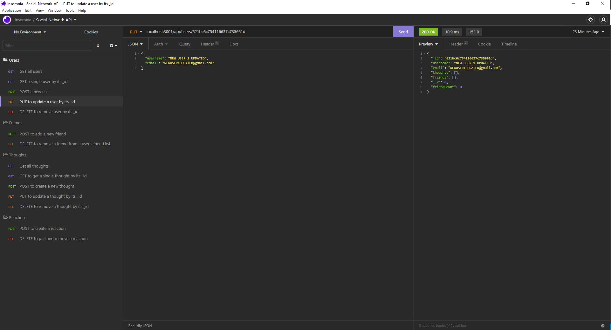

# NoSQL-Social-Network-API
This project was created to build an API for a social network web application where users can share their thoughts, react to friends’ thoughts, and create a friend list

## Built With
* Javascript
* NodeJS
* ExpressJS
* MongoDB
* Mongoose

## Website
Video Link: https://drive.google.com/file/d/1tlUqVRrcRemr_la07li_CUqKiyzxea7y/view

## Usage
```
1. Run "npm i" in your terminal to initialize with a package.json and recieve all dependencies

2. Run "npm start" in your terminal to connect to the server

3. Next open your favorite application for interacting with HTTP-based APIs(I used Insomnia)

4. Test your api end points.(here are what some of your routes could look like)

5. 

## Contribution
Made with ❤️ by [Connor Hollis]
